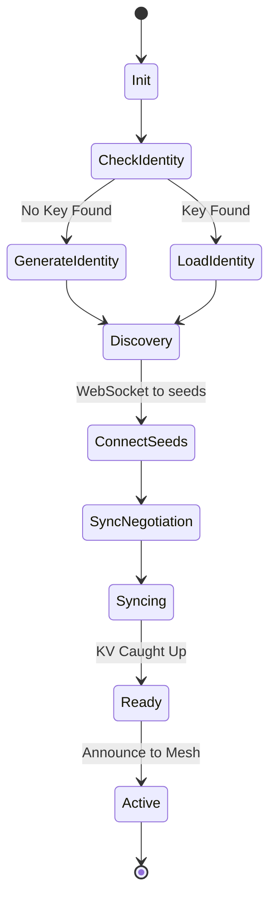

# Nell Core Overhaul: Detailed Technical Specification

**Date:** 2026-06-12
**Status:** Implementation-Ready
**Topic:** Core Architectural Enhancements for NellDB

## 1. Introduction
NellDB's current PoC implementation uses a flat keyspace, JSON-over-HTTP sync, and linear vector scans. This document specifies the transition to a collection-aware, binary-synced, and highly optimized vector database with declarative security rules.

---

## 2. Data Model & Namespaces

### 2.1 Updated `Record` Struct
We will add an explicit `Collection` field and consolidate the `DataType` into a fixed set of string constants.

```go
const DefaultCollection = "default"

type DataType string
const (
    TypeText   DataType = "text"
    TypeVector DataType = "vector"
    TypeImage  DataType = "image"
)

type Record struct {
    Collection string    `json:"collection" protobuf:"1"`
    ID         string    `json:"id" protobuf:"2"`
    Type       string    `json:"type" protobuf:"3"` // Mapped to DataType
    Payload    []byte    `json:"payload,omitempty" protobuf:"4"`
    Vector     []float32 `json:"vector,omitempty" protobuf:"5"`
    Clock      HLC       `json:"clock" protobuf:"6"`
    UpdatedBy  string    `json:"updated_by" protobuf:"7"` // Must be a validated NodeID
    Deleted    bool      `json:"deleted" protobuf:"8"`
}
```

### 2.2 Store Interface Refactoring
Every interaction with the `Store` must now be collection-aware.

```go
type Store interface {
    // Write operations
    Put(incoming Record) (accepted bool, current Record, err error)
    Delete(collection, id string) (Record, error)

    // Read operations
    Get(collection, id string) (Record, error)
    List(collection string) ([]Record, error)
    
    // Query & Sync
    Query(q Query) ([]Record, error)
    GetChangesSince(since HLC) ([]Record, error)

    NodeID() string
    Close() error
}
```

---

## 3. Security Rules (CEL-go Integration)

### 3.1 Rule Definition & Bootstrapping
Rules are defined in YAML and distributed via a reserved `_system_rules` collection.
- **Bootstrapping:** The `_system_rules` collection is **exempt** from CEL evaluation. It is writable only by nodes carrying a specific `admin: true` claim in their JWT.
- **JWT Verification:** Tokens are verified against a JWKS endpoint. The server performs a background refresh of the JWKS every `auth.jwks_refresh_interval_seconds` (default: 3600).

```yaml
rules:
  - match: collections/memories/{docId}
    allow: 
      read: "request.auth != null"
      write: "request.auth.uid == resource.data.ownerId || resource == null"
```

### 3.2 Evaluation Logic
- **Default-Deny:** Evaluation errors result in a hard `DENY`.
- **Read Rules:** Gates `Get` calls. For `Query`, read rules act as a filter; non-compliant records are omitted from results.

---

## 4. Tombstone Garbage Collection (Hybrid-TTL)

### 4.1 Compaction & Safety
- **Scheduling:** The compactor runs every `compaction.interval_minutes` (default: 60).
- **Concurrency Safety:** V1 uses a simple **Read-Write Mutex** per segment. A sync pull acquires a Read-lock, blocking the Compactor's Write-lock (rewrite) for that segment.
- **Quorum:** `min(KV[active_peers]) > tombstone.Clock`. Peers not seen for `staleness_eviction_days` (default 14) are excluded from the quorum.

---

## 5. Binary Wire Protocol (Protobuf)

### 5.1 Protobuf Schema (`nell.proto`)
```protobuf
syntax = "proto3";
package nell;

message HLC {
  int64 wall_time = 1;
  int32 counter = 2;
}

message Record {
  string collection = 1;
  string id = 2;
  string type = 3; 
  bytes payload = 4;
  repeated float32 vector = 5;
  HLC clock = 6;
  string updated_by = 7;
  bool deleted = 8;
}

message SyncBatch {
  repeated Record changes = 1;
  map<string, HLC> knowledge_vector = 2;
  string subscription_id = 3; // Reserved for future filtering
}
```

---

## 6. Vector Index Lifecycle

### 6.1 PCA, PQ & HNSW Training
- **Training Trigger:** PCA/PQ training occurs once a collection reaches `vector.training_sample_size` (default: 5000).
- **Retraining:** Retrain based on insertion count: every `vector.retraining_insert_threshold` (default: 50,000) new records.
- **Dimension Mismatch:** Hard rejection. A `Put` with incorrect dimensions returns **400 Bad Request**.

### 6.2 WASM Memory
The HNSW graph is pinned in a `Uint32Array` in WASM linear memory. Growth is requested in 16MB chunks.

---

## 7. Sync Protocol

### 7.1 Transport & Replication
Sync operates over **WebSocket**.
- **Snapshots:** Initial cold-start catch-up reuses the `SyncBatch` protobuf message, sent as a stream of chunked batches.
- **Filtering:** V1 mandates **full-dataset replication**. The `subscription_id` is reserved for future collection-scoped sync.
- **Idempotency:** On sync retry, if a tombstone is received for a record that has already been GC'd locally, it is treated as a **no-op**.

---

## 8. Node Identity & Bootstrap Protocol

### 8.1 Identity & State Machine
Identity is an Ed25519 public key (`node_id`). **Important:** The `UpdatedBy` field in incoming records MUST be validated against known peer identities during conflict resolution to prevent identity spoofing.



---

## 9. JS SDK & WASM Bridge

### 9.1 Hydration & Read Fallback
- **Hydration State:** During the IndexedDB-to-WASM hydration phase, the SDK enters a `HYDRATING` state.
- **Read Fallback:** Calls to `db.get()` during this state fall back to a direct IndexedDB lookup. Once hydration completes, the SDK switches to the high-performance WASM `MemoryStore`.

---

## 10. Observability & Configuration

### 10.1 `nell.yaml` Configuration Schema
```yaml
server:
  port: 8080
  data_dir: "/var/lib/nell"
  max_skew_ms: 500
web:
  enabled: true
auth:
  jwks_url: "https://auth.example.com/.well-known/jwks.json"
  jwks_refresh_interval_seconds: 3600
sync:
  max_batch_size: 1000
  staleness_eviction_days: 14
compaction:
  interval_minutes: 60
vector:
  enable_hnsw: true
  pca_dimensions: 128
  training_sample_size: 5000
  retraining_insert_threshold: 50000
  pq_subspaces: 16
  pq_centroids: 256
```

### 10.2 Metrics Surface
In addition to standard latency histograms:
- `nell_hlc_skew_rejected_total`: Counter for clock-skew rejects.
- `nell_index_overflow_buffer_size`: Gauge for HNSW rebuild urgency.
- `nell_compaction_duration_seconds`: Histogram for segment rewrite time.
